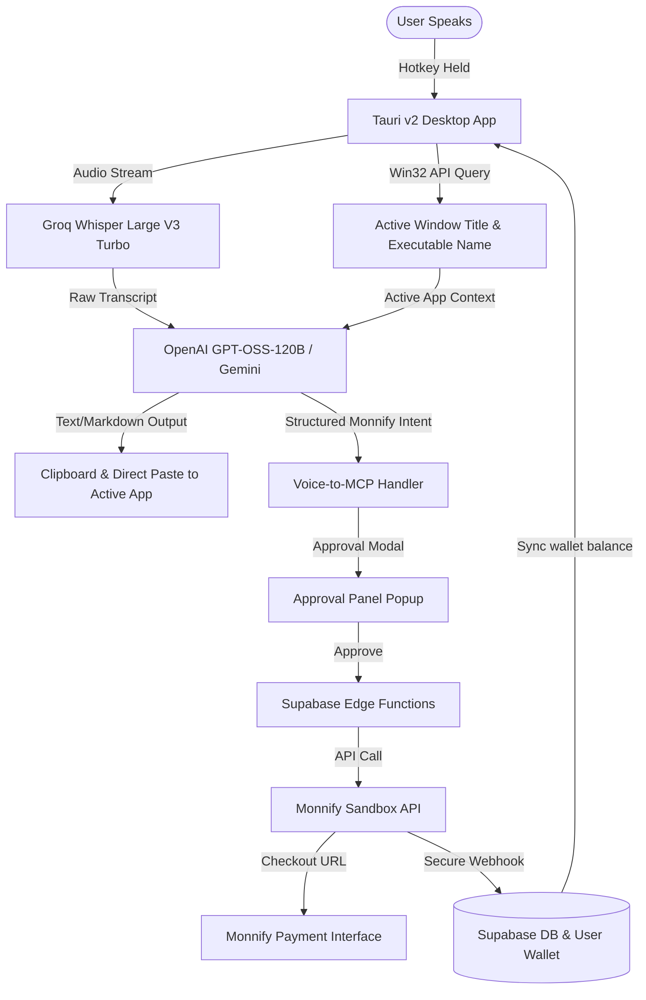

# Ikor — Agentic Voice-to-MCP Payment & Productivity Infrastructure

Ikor is a windowless, lightweight speech overlay that lets you type anywhere on your screen using your voice, apply app-aware AI formatting (ScribePro), and execute financial operations via spoken commands (Voice to MCP) integrated with the **Monnify Sandbox API**.

Built with **Tauri v2**, **React 19**, **TypeScript**, and **Tailwind 4**.

---

## 🚀 Quick Start (For Hackathon Judges)

If you do not want to install Rust and compile the source code locally, you can run the pre-compiled application.

1. **Download the Installer:**
   - Go to the [Releases](https://github.com/thecoachakpan/ikor-apiconf-2026/releases) page of this repository.
   - Download the latest `.exe` (Windows) installer.
2. **Bypass SmartScreen (Windows):**
   - Since this is an unsigned developer build, Windows Defender will show a warning (*"Windows protected your PC"*).
   - Click **"More info"** and then select **"Run anyway"**.
3. **Log In with Test Credentials:**
   - Once the app launches, you can log in immediately using the following pre-created test account:
     - **Email:** `testikor@gmail.com`
     - **Password:** `ikor@apiconf2026`
4. **⚠️ Critical Prerequisite for Voice to MCP:**
   - The application launches the Monnify MCP server locally using `npx`.
   - Therefore, the host machine **must have Node.js and npm/npx installed** for the **Voice to MCP** feature to work.

---

## 🖥️ PC Specifications & System Requirements

To run the pre-compiled application smoothly:
- **Operating System:** Windows 10 (version 1903 or higher) or Windows 11 (64-bit). *(Required for native Win32 window context and active app detection)*
- **Processor (CPU):** Intel Core i3 / AMD Ryzen 3 or higher. (Intel Core i5 / AMD Ryzen 5 recommended for local Whisper decoding).
- **Memory (RAM):** 4 GB minimum (8 GB recommended).
- **Disk Space:** ~150 MB for the core installation (~1.5 GB additional space required only if using the offline local Whisper model fallback).
- **Hardware:** A functional microphone input device.
- **Network:** An active internet connection for low-latency cloud transcription and parsing.

---

## 🛠️ Developer Setup & Local Compilation

To inspect the source code, configure custom API endpoints, and run the project in development mode:

### 1. Prerequisites
Ensure you have the following installed on your machine:
- **Node.js (LTS version)** & **npm/npx** (required to run the local Monnify MCP server)
- **Rust & Cargo (stable)**
- **Windows C++ Build Tools** (specifically the "Desktop development with C++" workload from Visual Studio Build Tools)
- **WebView2 Runtime** (typically installed by default on Windows 10/11)
- See the official [Tauri Windows Setup Guide](https://v2.tauri.app/start/prerequisites/#windows) for details.

### 2. Installation
1. Clone the repository:
   ```bash
   git clone https://github.com/thecoachakpan/ikor-apiconf-2026.git
   cd ikor-apiconf-2026
   ```
2. Install frontend and Tauri node dependencies:
   ```bash
   npm install
   ```

### 3. Running Locally
Run the following command to launch the application in development mode:
```bash
npm run tauri dev
```

---

## 📐 Voice-to-MCP Wallet Architecture

The flow below outlines how a spoken financial command is captured, parsed, verified, and settled.

```
Voice Input ➔ Whisper ASR ➔ LLM parsing (openai/gpt-oss-120b) ➔ Monnify MCP call (e.g., monnify_initiate_payment) ➔ User Approval Modal ➔ Supabase Edge Function ➔ Monnify Checkout ➔ Payer completes transfer ➔ Server-to-server webhook validation ➔ Credit user's wallet
```

---

## 🧠 System Architecture

The following Mermaid diagram maps out the complete interaction lifecycle from keyboard hotkey triggers to local OS detection and remote API executions.



---

## 🚨 Rules the Architecture Enforces

- **Human-in-the-Loop Approval:** No voice command can execute a payment or debit mandate automatically. Every parsed MCP tool call triggers a local popup requiring manual verification and click-to-approve.
- **Active Window Context Isolation:** Win32 API window tracking and categorization happens purely locally on the Rust backend.
- **Data Minimization:** Dictations, transcript histories, and API credentials are kept in sandboxed local storage (`StoreRef` / IndexedDB) and are never synced to the cloud without approval.
- **Remote Kill Switch:** If Groq's APIs lag or experience cost spikes, backend configurations in Supabase can redirect traffic to alternative models (e.g., Gemini Flash) in real time without client builds.
- **Physical-to-Logical Scaling:** Windows DPI-scaling factors are calculated dynamically to position the window overlay relative to the usable `workArea` (ignoring taskbars) on 1080p, 4K, or multi-monitor environments.
- **Z-Order Dominance:** The window pill re-asserts its `alwaysOnTop` status in a 5-second background loop to prevent other overlays from obscuring it.

---

## 🎮 Interactive Demo Guide (The 3 Modes)

Once the application is running and you are logged in, try these three core features:

### 🎙️ Mode 1: Normal Dictation (Low-latency Typing)
Provides accurate speech-to-text directly into any text input.
1. Open any text editor (Notepad, VS Code, a browser search bar).
2. Focus your cursor inside the text area.
3. **Press and hold `Ctrl + Alt`** on your keyboard. The circular waveform overlay will appear on your screen.
4. Ensure that your system mic icon shows or is active in the system tray area of your taskbar.
5. Dictate a sentence (e.g., *"I am running a voice payment app on my local machine and dictating perfectly."*).
6. **Release the keys.** The app transcribes the audio and instantly pastes the text at your cursor.

---

### ✍️ Mode 2: ScribePro (App-Aware Formatting)
Uses your active window's identity to format and style transcripts intelligently.
1. Open **VS Code** (or a code editor) and focus on a code file, OR open **Slack** and focus on a message input.
2. **Hold `Ctrl + Win`** and dictate your text:
   - **In Slack/Notion:** Say *"tag John Doe and set up a call for 8am. Oh no, schedule the call for 10am instead."* ➔ Ikor detects you are in Slack and auto-formats the mention to `@John Doe` instead of plain text, then applies your intent to schedule the call for 10am.

---

### 💳 Mode 3: Voice to MCP (Wallet Top-Ups via Monnify)
Translates spoken intent into structured financial operations using the Monnify Sandbox.
*Note: Voice to MCP currently works for Ikor users to top-up words in their wallets. You do NOT need to configure your own API keys in the MCP Server settings for this demo tier.*

1. Open the Ikor dashboard or focus your cursor on any app
2. **Hold `Ctrl + Shift + S`** and speak a top-up command:
   - *“Top up my wallet with 1,000 Naira.”*
   - *“Add 3000 Naira to my word balance.”*
3. **Release the keys.**
4. Instead of typing, the **Approval Panel / MCP Confirmation Modal** will pop up on your screen.
5. Review the payload of the API call. Click **Approve** or press **Enter** on your keyboard to open the Monnify sandbox checkout page, or **Cancel** to abort.

---

## 🛠️ Project Stack

- **Tauri v2:** Rust-backed desktop client framework providing native OS access (Win32 APIs).
- **React 19 + TypeScript:** Frontend library powering the overlay GUI.
- **Tailwind 4:** Advanced utility-first styles for modern, high-performance UI designs.
- **Deepgram API:** Deepgram Nova 3 Stream model for near-instant STT experience on Ultrafast speed mode.
- **Groq API:** Groq Whisper Large V3 Turbo for ultra-low latency transcription on fast speed mode and `openai/gpt-oss-120b` for intent routing.
- **Supabase:** Backend database, authentication, and secure payment Edge Functions.
- **Monnify Sandbox:** Financial collection API (Checkout, Subaccounts, Mandates, Verification).
- **Monnify MCP Server:** Local Node-based MCP server running Monnify tools.

---

## 📂 Project Directory Structure

```
├── src/                               # React 19 Frontend Code
│   ├── components/                    # UI Components
│   │   ├── ApprovalPanel.tsx          # Voice-to-MCP confirmation dialog
│   │   ├── McpConfirmationModal.tsx   # Transaction approval details
│   │   └── Dashboard/                 # Settings and user statistics
│   ├── lib/                           # Core utilities
│   │   └── mcpClient.ts               # Spoken intent to Monnify MCP parser
│   ├── App.tsx                        # Main application frame
│   ├── main.tsx                       # React application root
│   └── index.css                      # Tailwind styling and iridescence animations
├── src-tauri/                         # Rust Tauri v2 Backend Code
│   ├── src/
│   │   ├── lib.rs                     # Win32 focus query, global hotkeys, window positioning
│   │   └── main.rs                    # App entry point
│   ├── Cargo.toml                     # Rust dependencies (windows-sys, tauri)
│   └── tauri.conf.json                # Desktop application permissions and capabilities
├── supabase/                          # Backend Edge Functions
│   └── functions/
│       ├── initialize-monnify-payment/ # Secure checkout generation
│       └── verify-monnify-payment/     # Server-to-server transaction status check
├── public/                            # Static asset folder
├── package.json                       # Node dependencies
└── vite.config.ts                     # Vite bundle options
```

---

## 🔒 Security Posture

Ikor keeps your credentials secure and transactions transparent. Key security features:
- **Human-in-the-Loop Confirmation:** Prevents silent, voice-triggered financial transactions.
- **Local Credentials Isolation:** Stores API tokens on your machine inside Tauri's sandboxed local store.
- **Secure Server-to-Server Verification:** Supabase edge functions directly query Monnify's API to confirm payments, protecting key secrets.

For more details, see [SECURITY.md](SECURITY.md).

---

## ⚠️ Limitations

- **Windows Native APIs:** Active application title checking and DPI scaling calculations utilize Windows Win32 APIs, making the full featureset exclusive to Windows.
- **API Dependencies:** Dictation and ScribePro require an active internet connection to communicate with Deepgram or Groq cloud endpoints. If offline, the application falls back to a local Whisper engine (which runs slower depending on local hardware capabilities).
- **Sandbox Environment:** Monnify transaction verification is simulated. Production deployments require a fully verified Monnify merchant profile and KYC.

---

## 🔒 License & Disclaimer

Copyright (c) 2026 Victor Akpan (Ikor). All rights reserved.

A limited, temporary license is granted to the organizers, judges, and evaluators of the **APIConf Lagos 2026 Developer Challenge** to download, compile, and run this code solely for evaluation purposes. No permission is granted to copy, distribute, modify, or create derivative works for any other purpose. See the [LICENSE](LICENSE) file for details.

### Liability Disclaimer

THE SOFTWARE IS PROVIDED "AS IS", WITHOUT WARRANTY OF ANY KIND, EXPRESS OR IMPLIED, INCLUDING BUT NOT LIMITED TO THE WARRANTIES OF MERCHANTABILITY, FITNESS FOR A PARTICULAR PURPOSE, AND NONINFRINGEMENT. IN NO EVENT SHALL THE AUTHORS, COPYRIGHT HOLDERS, OR INTEGRATION COLLABORATORS BE LIABLE FOR ANY CLAIM, DAMAGES, OR OTHER LIABILITY, WHETHER IN AN ACTION OF CONTRACT, TORT, OR OTHERWISE, ARISING FROM, OUT OF OR IN CONNECTION WITH THE SOFTWARE OR THE USE OR OTHER DEALINGS IN THE SOFTWARE.
